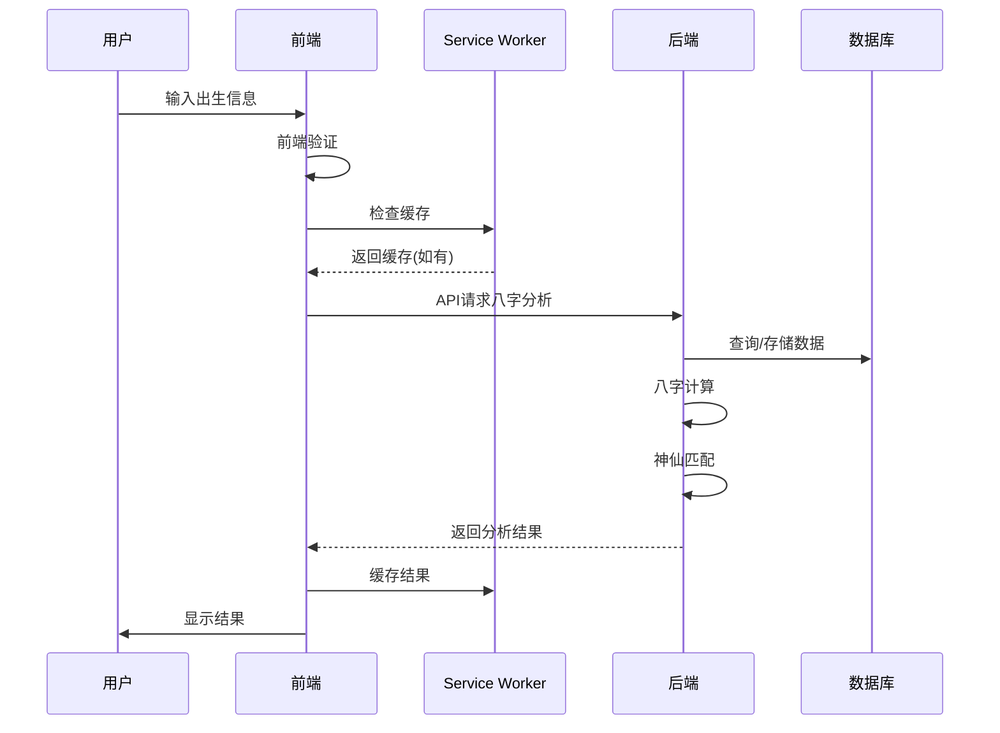
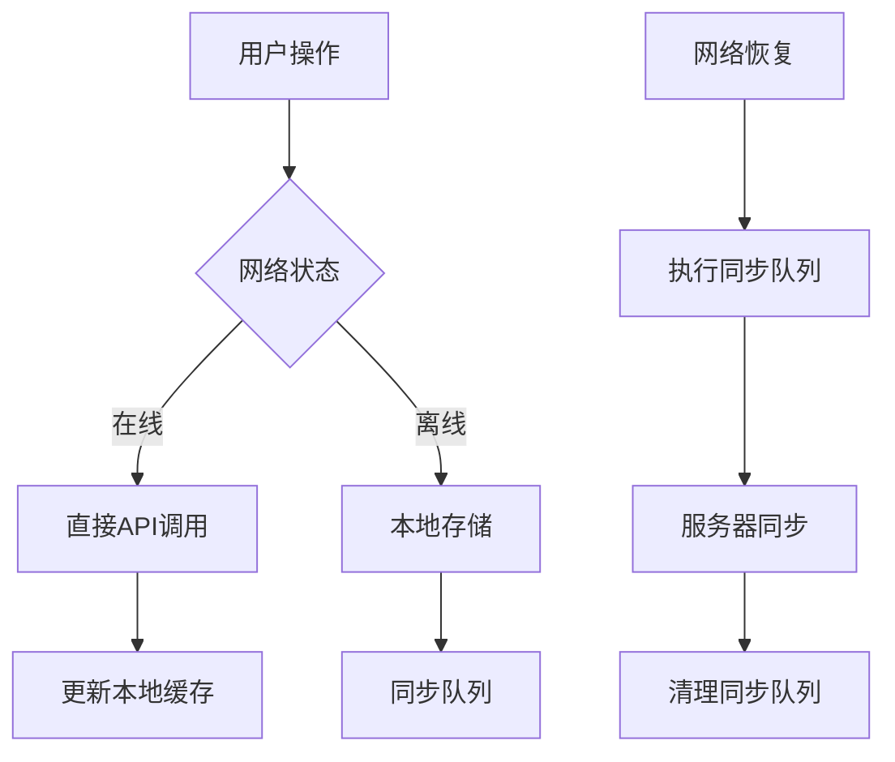

# 神仙朋友 PWA 完整架构总结

## 🎯 项目概述

神仙朋友是一款基于八字命理分析的智能PWA应用，结合传统文化与现代技术，为用户提供个性化的神仙朋友匹配、命理指导和心灵陪伴服务。

## 🏗️ 架构设计原则

### 1. 渐进式增强
- 基础功能在所有设备上可用
- 高级特性在支持的设备上逐步启用
- 优雅降级确保用户体验一致

### 2. 离线优先
- Service Worker 提供完整的离线缓存
- IndexedDB 本地数据持久化
- 网络恢复时自动同步

### 3. 性能优化
- 代码分割和懒加载
- 智能缓存策略
- 资源预加载和压缩

### 4. 安全第一
- HTTPS 强制加密
- 数据加密存储
- 输入验证和防XSS

## 📊 完整技术栈

### 前端技术栈
```typescript
// 核心框架
React 18.2.0          // UI框架
TypeScript 5.0+       // 类型安全
Vite 4.0+            // 构建工具

// PWA特性
Service Worker        // 离线缓存和后台同步
Web App Manifest      // 应用安装和配置
Push API             // 推送通知
IndexedDB            // 本地数据库
Cache API            // 资源缓存

// 状态管理
React Context API     // 全局状态管理
Custom Hooks         // 业务逻辑封装

// 样式系统  
CSS Modules          // 样式隔离
CSS Variables        // 主题系统
Responsive Design    // 响应式设计

// 开发工具
ESLint + Prettier    // 代码规范
TypeScript ESLint    // 类型检查
Lighthouse           // 性能审计
```

### 后端技术栈
```python
# Web框架
Flask 2.3.0          # 轻量级Web框架
Flask-CORS           # 跨域支持

# 八字计算
sxtwl                # 寿星天文历库
bidict               # 双向字典
pandas               # 数据处理

# 数据存储
SQLite               # 轻量级数据库
Redis                # 缓存和会话

# 部署工具
Docker               # 容器化
Gunicorn             # WSGI服务器
Nginx                # 反向代理

# 开发工具
pytest               # 单元测试
Black                # 代码格式化
mypy                 # 类型检查
```

## 🔄 数据流架构

### 1. 用户交互流程


### 2. 离线数据同步


## 🎨 前端架构详解

### 1. 组件架构
```
src/
├── components/
│   ├── ui/                    # 通用UI组件
│   │   ├── Button.tsx         # 按钮组件
│   │   ├── Card.tsx           # 卡片组件
│   │   └── Modal.tsx          # 模态框组件
│   ├── layout/                # 布局组件
│   │   ├── Header.tsx         # 页头
│   │   ├── Navigation.tsx     # 导航
│   │   └── Footer.tsx         # 页脚
│   └── features/              # 功能组件
│       ├── deity-friend/      # 神仙朋友功能
│       ├── fortune-analysis/  # 命理分析功能
│       ├── nfc-integration/   # NFC集成功能
│       ├── audio-player/      # 音频播放功能
│       ├── blessing-system/   # 祝福系统功能
│       └── user-settings/     # 用户设置功能
├── pages/                     # 页面组件
│   ├── HomePage.tsx           # 首页
│   ├── ChatPage.tsx           # 对话页面
│   ├── BraceletPage.tsx       # 手串页面
│   └── SettingsPage.tsx       # 设置页面
├── hooks/                     # 自定义Hooks
│   ├── useLocalStorage.ts     # 本地存储Hook
│   ├── useDeityChat.ts        # 神仙对话Hook
│   └── useBracelet.ts         # 手串验证Hook
├── services/                  # 业务服务
│   ├── baziService.ts         # 八字计算服务
│   ├── databaseService.ts     # 数据库服务
│   ├── enhancedBaziService.ts # 增强八字服务
│   └── nfcService.ts          # NFC服务
├── types/                     # TypeScript类型
│   ├── index.ts               # 通用类型
│   ├── bazi.ts                # 八字相关类型
│   └── community.ts           # 社区类型
└── utils/                     # 工具函数
    ├── constants.ts           # 常量定义
    ├── helpers.ts             # 辅助函数
    └── deepseek-api.ts        # AI API集成
```

### 2. 状态管理策略
```typescript
// 全局状态结构
interface AppState {
  user: {
    profile: UserProfile
    preferences: UserPreferences
    authStatus: AuthStatus
  }
  bazi: {
    currentAnalysis: BaziAnalysis | null
    history: BaziAnalysis[]
    deityRecommendation: DeityRecommendation | null
  }
  chat: {
    messages: ChatMessage[]
    currentDeity: Deity | null
    isTyping: boolean
  }
  app: {
    currentPage: AppPage
    theme: Theme
    networkStatus: NetworkStatus
    notifications: NotificationState
  }
}

// 状态更新模式
type AppAction = 
  | { type: 'SET_USER_PROFILE'; payload: UserProfile }
  | { type: 'UPDATE_BAZI_ANALYSIS'; payload: BaziAnalysis }
  | { type: 'ADD_CHAT_MESSAGE'; payload: ChatMessage }
  | { type: 'SET_NETWORK_STATUS'; payload: NetworkStatus }
```

## ⚙️ 后端架构详解

### 1. API设计
```python
# RESTful API结构
/api/
├── /calculate-bazi          # POST - 八字计算
├── /match-deities          # POST - 神仙匹配
├── /analyze-bazi           # POST - 详细分析
├── /user/profile           # GET/PUT - 用户资料
├── /user/history           # GET - 分析历史
├── /chat/messages          # GET/POST - 聊天消息
├── /bracelet/verify        # POST - 手串验证
├── /daily-fortune          # GET - 今日运势
└── /health                 # GET - 健康检查

# WebSocket endpoints (可选)
/ws/chat                    # 实时聊天
/ws/notifications           # 实时通知
```

### 2. 八字计算核心
```python
class BaziCalculationEngine:
    """八字计算引擎"""
    
    def __init__(self):
        self.sxtwl_calendar = sxtwl.Lunar()
        self.element_mappings = self._load_element_mappings()
        self.deity_database = self._load_deity_database()
    
    def calculate_full_bazi(self, birth_info: BirthInfo) -> BaziChart:
        """完整八字计算"""
        # 1. 时间转换
        lunar_date = self._convert_to_lunar(birth_info)
        
        # 2. 四柱计算
        pillars = self._calculate_four_pillars(lunar_date)
        
        # 3. 五行分析
        elements = self._analyze_elements(pillars)
        
        # 4. 十神分析
        ten_deities = self._analyze_ten_deities(pillars)
        
        # 5. 格局判断
        pattern = self._determine_pattern(pillars, elements)
        
        return BaziChart(
            pillars=pillars,
            elements=elements,
            ten_deities=ten_deities,
            pattern=pattern
        )
    
    def match_deities(self, bazi_chart: BaziChart) -> DeityRecommendation:
        """神仙匹配算法"""
        # 1. 五行平衡分析
        element_balance = self._analyze_element_balance(bazi_chart)
        
        # 2. 性格特质分析
        personality_traits = self._analyze_personality(bazi_chart)
        
        # 3. 神仙兼容性计算
        compatibility_scores = []
        for deity in self.deity_database:
            score = self._calculate_compatibility(deity, bazi_chart)
            compatibility_scores.append((deity, score))
        
        # 4. 排序和推荐
        sorted_matches = sorted(compatibility_scores, 
                              key=lambda x: x[1], reverse=True)
        
        return self._build_recommendation(sorted_matches)
```

### 3. 神仙匹配算法
```python
def _calculate_compatibility(self, deity: Deity, bazi_chart: BaziChart) -> float:
    """计算神仙兼容性得分"""
    
    # 权重配置
    weights = {
        'element_harmony': 0.35,      # 五行调和
        'personality_match': 0.25,    # 性格匹配
        'need_fulfillment': 0.20,     # 需求满足
        'seasonal_affinity': 0.10,    # 季节亲和
        'life_stage_match': 0.10      # 人生阶段匹配
    }
    
    scores = {}
    
    # 1. 五行调和度
    scores['element_harmony'] = self._calculate_element_harmony(
        deity.elements, bazi_chart.elements
    )
    
    # 2. 性格匹配度
    scores['personality_match'] = self._calculate_personality_match(
        deity.personality_traits, bazi_chart.personality_analysis
    )
    
    # 3. 需求满足度
    scores['need_fulfillment'] = self._calculate_need_fulfillment(
        deity.specialties, bazi_chart.life_challenges
    )
    
    # 4. 季节亲和度
    scores['seasonal_affinity'] = self._calculate_seasonal_affinity(
        deity.seasonal_preferences, bazi_chart.birth_season
    )
    
    # 5. 人生阶段匹配度
    scores['life_stage_match'] = self._calculate_life_stage_match(
        deity.guidance_style, bazi_chart.life_stage
    )
    
    # 加权计算总分
    total_score = sum(scores[key] * weights[key] for key in scores)
    
    return min(total_score, 1.0)
```

## 💾 数据持久化策略

### 1. 前端存储架构
```typescript
// 存储层次结构
interface StorageArchitecture {
  // 1. 内存缓存 (最快访问)
  memoryCache: Map<string, any>
  
  // 2. IndexedDB (持久化存储)
  indexedDB: {
    users: UserData[]
    baziAnalysis: StoredBaziAnalysis[]
    chatHistory: StoredChatMessage[]
    deityRecommendations: StoredDeityRecommendation[]
    syncQueue: SyncQueueItem[]
    cacheData: CacheItem[]
  }
  
  // 3. LocalStorage (简单配置)
  localStorage: {
    userPreferences: UserPreferences
    appSettings: AppSettings
    lastVisit: string
  }
  
  // 4. SessionStorage (临时数据)
  sessionStorage: {
    currentSession: SessionData
    temporaryInputs: FormData
  }
}

// 数据同步策略
class DataSyncStrategy {
  async syncToServer(data: SyncableData): Promise<void> {
    if (navigator.onLine) {
      // 在线：直接同步
      await this.uploadToServer(data)
    } else {
      // 离线：加入同步队列
      await this.addToSyncQueue(data)
    }
  }
  
  async backgroundSync(): Promise<void> {
    const queue = await this.getSyncQueue()
    for (const item of queue) {
      try {
        await this.uploadToServer(item.data)
        await this.removeFromSyncQueue(item.id)
      } catch (error) {
        item.retryCount++
        if (item.retryCount > 3) {
          await this.markAsFailed(item)
        }
      }
    }
  }
}
```

### 2. 后端数据模型
```python
# 数据库模型设计
class User(db.Model):
    id = db.Column(db.Integer, primary_key=True)
    name = db.Column(db.String(100), nullable=False)
    birth_date = db.Column(db.DateTime, nullable=False)
    gender = db.Column(db.String(10), nullable=False)
    created_at = db.Column(db.DateTime, default=datetime.utcnow)
    last_login = db.Column(db.DateTime)
    
    # 关系
    bazi_analyses = db.relationship('BaziAnalysis', backref='user')
    chat_messages = db.relationship('ChatMessage', backref='user')
    deity_recommendations = db.relationship('DeityRecommendation', backref='user')

class BaziAnalysis(db.Model):
    id = db.Column(db.Integer, primary_key=True)
    user_id = db.Column(db.Integer, db.ForeignKey('user.id'))
    
    # 四柱数据
    year_stem = db.Column(db.String(10))
    year_branch = db.Column(db.String(10))
    month_stem = db.Column(db.String(10))
    month_branch = db.Column(db.String(10))
    day_stem = db.Column(db.String(10))
    day_branch = db.Column(db.String(10))
    hour_stem = db.Column(db.String(10))
    hour_branch = db.Column(db.String(10))
    
    # 分析结果 (JSON存储)
    personality_analysis = db.Column(db.JSON)
    career_analysis = db.Column(db.JSON)
    health_analysis = db.Column(db.JSON)
    relationship_analysis = db.Column(db.JSON)
    
    created_at = db.Column(db.DateTime, default=datetime.utcnow)

class DeityRecommendation(db.Model):
    id = db.Column(db.Integer, primary_key=True)
    user_id = db.Column(db.Integer, db.ForeignKey('user.id'))
    bazi_analysis_id = db.Column(db.Integer, db.ForeignKey('bazi_analysis.id'))
    
    primary_deity_id = db.Column(db.String(50))
    compatibility_score = db.Column(db.Float)
    match_reasons = db.Column(db.JSON)
    personalized_blessings = db.Column(db.JSON)
    
    created_at = db.Column(db.DateTime, default=datetime.utcnow)
```

## 🔐 安全架构

### 1. 数据安全
```typescript
// 前端数据加密
class SecurityService {
  private static readonly ENCRYPTION_KEY = await this.generateKey()
  
  static async encryptSensitiveData(data: any): Promise<string> {
    const encoder = new TextEncoder()
    const dataBuffer = encoder.encode(JSON.stringify(data))
    
    const encrypted = await crypto.subtle.encrypt(
      { name: 'AES-GCM', iv: crypto.getRandomValues(new Uint8Array(12)) },
      this.ENCRYPTION_KEY,
      dataBuffer
    )
    
    return btoa(String.fromCharCode(...new Uint8Array(encrypted)))
  }
  
  static async validateInput(input: string): Promise<boolean> {
    // XSS防护
    const xssPattern = /<script|javascript:|on\w+\s*=/i
    if (xssPattern.test(input)) return false
    
    // SQL注入防护
    const sqlPattern = /('|(\\')|(;)|(\\;)|(--)|(\s*(union|select|insert|delete|update|drop|create|alter|exec|execute|sp_|xp_))/i
    if (sqlPattern.test(input)) return false
    
    return true
  }
}
```

### 2. API安全
```python
# 后端安全中间件
from functools import wraps
from flask import request, jsonify
import jwt
import hashlib

def require_auth(f):
    @wraps(f)
    def decorated_function(*args, **kwargs):
        token = request.headers.get('Authorization')
        if not token:
            return jsonify({'error': 'Token missing'}), 401
        
        try:
            token = token.replace('Bearer ', '')
            payload = jwt.decode(token, app.config['SECRET_KEY'], algorithms=['HS256'])
            request.user_id = payload['user_id']
        except jwt.ExpiredSignatureError:
            return jsonify({'error': 'Token expired'}), 401
        except jwt.InvalidTokenError:
            return jsonify({'error': 'Invalid token'}), 401
        
        return f(*args, **kwargs)
    return decorated_function

def validate_input(data, schema):
    """输入验证装饰器"""
    def decorator(f):
        @wraps(f)
        def decorated_function(*args, **kwargs):
            try:
                # 验证数据格式
                validated_data = schema().load(data)
                request.validated_data = validated_data
            except ValidationError as e:
                return jsonify({'error': 'Invalid input', 'details': e.messages}), 400
            
            return f(*args, **kwargs)
        return decorated_function
    return decorator
```

## 📱 PWA特性实现

### 1. Service Worker架构
```typescript
// Service Worker 核心功能
class DivineFriendServiceWorker {
  private cacheStrategies = {
    'static': this.cacheFirst,
    'api': this.networkFirst,
    'bazi': this.staleWhileRevalidate
  }
  
  async handleRequest(request: Request): Promise<Response> {
    const url = new URL(request.url)
    
    // 路由策略选择
    if (url.pathname.startsWith('/api/calculate-bazi')) {
      return this.cacheStrategies.bazi(request)
    } else if (url.pathname.startsWith('/api/')) {
      return this.cacheStrategies.api(request)
    } else {
      return this.cacheStrategies.static(request)
    }
  }
  
  async cacheFirst(request: Request): Promise<Response> {
    const cachedResponse = await caches.match(request)
    if (cachedResponse) return cachedResponse
    
    const networkResponse = await fetch(request)
    if (networkResponse.ok) {
      const cache = await caches.open('static-v1')
      cache.put(request, networkResponse.clone())
    }
    
    return networkResponse
  }
  
  async networkFirst(request: Request): Promise<Response> {
    try {
      const networkResponse = await fetch(request)
      if (networkResponse.ok) {
        const cache = await caches.open('api-v1')
        cache.put(request, networkResponse.clone())
      }
      return networkResponse
    } catch (error) {
      const cachedResponse = await caches.match(request)
      if (cachedResponse) return cachedResponse
      throw error
    }
  }
  
  async staleWhileRevalidate(request: Request): Promise<Response> {
    const cachedResponse = await caches.match(request)
    
    const networkPromise = fetch(request).then(response => {
      if (response.ok) {
        const cache = await caches.open('bazi-v1')
        cache.put(request, response.clone())
      }
      return response
    })
    
    return cachedResponse || await networkPromise
  }
}
```

### 2. 推送通知系统
```typescript
// 推送通知管理
class NotificationManager {
  static async requestPermission(): Promise<boolean> {
    if (!('Notification' in window)) return false
    
    const permission = await Notification.requestPermission()
    return permission === 'granted'
  }
  
  static async subscribeToPush(): Promise<PushSubscription | null> {
    if (!('serviceWorker' in navigator) || !('PushManager' in window)) {
      return null
    }
    
    const registration = await navigator.serviceWorker.ready
    const subscription = await registration.pushManager.subscribe({
      userVisibleOnly: true,
      applicationServerKey: this.urlBase64ToUint8Array(PUBLIC_VAPID_KEY)
    })
    
    // 发送订阅信息到服务器
    await this.sendSubscriptionToServer(subscription)
    
    return subscription
  }
  
  static async sendLocalNotification(title: string, options: NotificationOptions) {
    if (Notification.permission === 'granted') {
      new Notification(title, {
        icon: '/icons/icon-192x192.png',
        badge: '/icons/badge-72x72.png',
        ...options
      })
    }
  }
}
```

## 🚀 性能优化策略

### 1. 代码分割和懒加载
```typescript
// 路由级别的代码分割
const HomePage = lazy(() => import('./pages/HomePage'))
const ChatPage = lazy(() => import('./pages/ChatPage'))
const BaziPage = lazy(() => import('./pages/BaziPage'))

// 组件级别的懒加载
const BaziCalculator = lazy(() => 
  import('./components/features/fortune-analysis/BaziCalculator')
)

// 动态导入工具函数
const loadBaziUtils = () => import('./utils/baziCalculations')

// 图片懒加载
const LazyImage: React.FC<{ src: string; alt: string }> = ({ src, alt }) => {
  const [isLoaded, setIsLoaded] = useState(false)
  const [isInView, setIsInView] = useState(false)
  const imgRef = useRef<HTMLImageElement>(null)
  
  useEffect(() => {
    const observer = new IntersectionObserver(([entry]) => {
      if (entry.isIntersecting) {
        setIsInView(true)
        observer.disconnect()
      }
    })
    
    if (imgRef.current) observer.observe(imgRef.current)
    
    return () => observer.disconnect()
  }, [])
  
  return (
     setIsLoaded(true)}
      style={{ opacity: isLoaded ? 1 : 0 }}
    />
  )
}
```

### 2. 缓存优化
```typescript
// 智能缓存管理
class CacheManager {
  private static readonly CACHE_CONFIGS = {
    'static': { maxAge: 365 * 24 * 60 * 60 * 1000 }, // 1年
    'api': { maxAge: 60 * 60 * 1000 },               // 1小时  
    'bazi': { maxAge: 7 * 24 * 60 * 60 * 1000 },     // 7天
    'images': { maxAge: 30 * 24 * 60 * 60 * 1000 }   // 30天
  }
  
  static async preloadCriticalResources() {
    const criticalResources = [
      '/icons/icon-192x192.png',
      '/avatars/guanyin.png',
      '/manifest.json'
    ]
    
    await Promise.all(
      criticalResources.map(url => 
        caches.open('critical-v1').then(cache => 
          cache.add(url)
        )
      )
    )
  }
  
  static async cleanupExpiredCache() {
    const cacheNames = await caches.keys()
    
    for (const cacheName of cacheNames) {
      const cache = await caches.open(cacheName)
      const requests = await cache.keys()
      
      for (const request of requests) {
        const response = await cache.match(request)
        const cachedDate = response?.headers.get('sw-cached-date')
        
        if (cachedDate && this.isExpired(cachedDate, cacheName)) {
          await cache.delete(request)
        }
      }
    }
  }
}
```

## 📈 监控和分析

### 1. 性能监控
```typescript
// 性能指标收集
class PerformanceMonitor {
  static collectWebVitals() {
    // Core Web Vitals
    getCLS(this.sendMetric)
    getFID(this.sendMetric)
    getFCP(this.sendMetric)
    getLCP(this.sendMetric)
    getTTFB(this.sendMetric)
  }
  
  static trackUserInteractions() {
    // 用户行为跟踪
    document.addEventListener('click', (event) => {
      const target = event.target as HTMLElement
      this.sendMetric({
        name: 'user_click',
        value: 1,
        labels: {
          element: target.tagName,
          className: target.className,
          id: target.id
        }
      })
    })
  }
  
  static trackAPIPerformance() {
    const originalFetch = window.fetch
    window.fetch = async (...args) => {
      const start = performance.now()
      try {
        const response = await originalFetch(...args)
        const duration = performance.now() - start
        
        this.sendMetric({
          name: 'api_request_duration',
          value: duration,
          labels: {
            url: args[0] as string,
            status: response.status
          }
        })
        
        return response
      } catch (error) {
        const duration = performance.now() - start
        this.sendMetric({
          name: 'api_request_error',
          value: duration,
          labels: {
            url: args[0] as string,
            error: error.message
          }
        })
        throw error
      }
    }
  }
}
```

### 2. 错误跟踪
```typescript
// 错误监控和上报
class ErrorTracker {
  static setupGlobalErrorHandling() {
    // JavaScript错误
    window.addEventListener('error', (event) => {
      this.reportError({
        type: 'javascript_error',
        message: event.message,
        filename: event.filename,
        line: event.lineno,
        column: event.colno,
        stack: event.error?.stack
      })
    })
    
    // Promise rejections
    window.addEventListener('unhandledrejection', (event) => {
      this.reportError({
        type: 'unhandled_promise_rejection',
        message: event.reason?.message || 'Unhandled promise rejection',
        stack: event.reason?.stack
      })
    })
    
    // React错误边界
    class ErrorBoundary extends React.Component {
      componentDidCatch(error: Error, errorInfo: React.ErrorInfo) {
        ErrorTracker.reportError({
          type: 'react_error',
          message: error.message,
          stack: error.stack,
          componentStack: errorInfo.componentStack
        })
      }
    }
  }
}
```

## 🔮 未来扩展规划

### 1. 技术升级路线
- **React 19**: 升级到最新React版本，利用新特性
- **AI增强**: 集成更先进的AI模型提升分析准确性
- **AR/VR**: 探索增强现实体验，如虚拟神仙显现
- **区块链**: 考虑NFT手串验证和去中心化存储

### 2. 功能扩展
- **社区功能**: 用户互动、经验分享、群组讨论
- **多语言支持**: 国际化适配，支持多种语言
- **个性化定制**: AI驱动的个性化界面和内容推荐
- **健康监测**: 结合可穿戴设备的健康数据分析

### 3. 平台扩展
- **原生应用**: React Native移动端应用
- **桌面应用**: Electron桌面客户端
- **小程序**: 微信/支付宝小程序版本
- **智能设备**: 智能音箱、车载系统集成

---

## 📝 总结

神仙朋友PWA采用了现代化的全栈架构，结合传统文化与先进技术，实现了：

✅ **完整的PWA特性** - 离线使用、安装支持、推送通知
✅ **精准的八字分析** - 基于传统算法的现代化实现
✅ **智能的神仙匹配** - 五行理论指导的算法设计
✅ **优秀的用户体验** - 响应式设计、流畅交互
✅ **强大的技术架构** - 可扩展、可维护、高性能
✅ **完备的安全保障** - 数据加密、输入验证、权限控制

这个架构为用户提供了一个真正有用、有趣、有价值的数字化传统文化体验平台。 