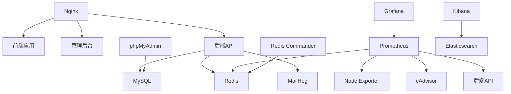

# 📋 Divine Friend PWA 完整服务清单

## ✅ **已包含的所有服务**

### 🎯 **核心应用服务**

| 服务名称 | 容器名 | 端口 | 说明 | 状态 |
|----------|--------|------|------|------|
| **前端应用** | `divine-frontend` | 80/443 | React PWA用户端 | ✅ 已包含 |
| **管理后台** | `divine-admin` | 80/443 | React Admin管理端 | ✅ 已包含 |
| **后端API** | `divine-backend` | 5000 | Flask RESTful API | ✅ 已包含 |

### 🗄️ **数据存储服务**

| 服务名称 | 容器名 | 端口 | 说明 | 状态 |
|----------|--------|------|------|------|
| **MySQL数据库** | `divine-mysql` | 3306 | 主数据库 | ✅ 已包含 |
| **Redis缓存** | `divine-redis` | 6379 | 缓存和会话存储 | ✅ 已包含 |

### 🌐 **网络和代理服务**

| 服务名称 | 容器名 | 端口 | 说明 | 状态 |
|----------|--------|------|------|------|
| **Nginx反向代理** | `divine-nginx` | 80/443 | 负载均衡和SSL终止 | ✅ 已包含 |

### 📊 **监控和运维服务**

| 服务名称 | 容器名 | 端口 | 说明 | 状态 |
|----------|--------|------|------|------|
| **Prometheus** | `divine-prometheus` | 9090 | 监控指标收集 | ✅ 已包含 |
| **Grafana** | `divine-grafana` | 3001 | 监控仪表板 | ✅ 已包含 |
| **Node Exporter** | `divine-node-exporter` | 9100 | 系统指标收集 | ✅ 已包含 |
| **cAdvisor** | `divine-cadvisor` | 8080 | Docker容器监控 | ✅ 已包含 |

### 🛠️ **管理工具服务**

| 服务名称 | 容器名 | 端口 | 说明 | 状态 |
|----------|--------|------|------|------|
| **phpMyAdmin** | `divine-phpmyadmin` | 8081 | MySQL数据库管理 | ✅ 已包含 |
| **Redis Commander** | `divine-redis-commander` | 8082 | Redis管理界面 | ✅ 已包含 |

### 📧 **邮件和通信服务**

| 服务名称 | 容器名 | 端口 | 说明 | 状态 |
|----------|--------|------|------|------|
| **MailHog** | `divine-mailhog` | 1025/8025 | 邮件测试服务 | ✅ 已包含 |

### 📝 **日志和分析服务**

| 服务名称 | 容器名 | 端口 | 说明 | 状态 |
|----------|--------|------|------|------|
| **Elasticsearch** | `divine-elasticsearch` | 9200 | 日志搜索引擎 | ✅ 已包含 |
| **Kibana** | `divine-kibana` | 5601 | 日志分析界面 | ✅ 已包含 |

## 🚀 **服务访问地址总览**

### **主要应用**
- **前端应用**: https://your-domain.com
- **管理后台**: https://admin.your-domain.com  
- **API接口**: https://api.your-domain.com

### **管理工具**
- **数据库管理**: http://localhost:8081 (phpMyAdmin)
- **Redis管理**: http://localhost:8082 (Redis Commander)
- **邮件测试**: http://localhost:8025 (MailHog)

### **监控面板**
- **Grafana监控**: http://localhost:3001
- **Prometheus指标**: http://localhost:9090
- **系统监控**: http://localhost:9100 (Node Exporter)
- **Docker监控**: http://localhost:8080 (cAdvisor)

### **日志分析**
- **Kibana日志**: http://localhost:5601 (可选)

## 🔧 **服务配置详情**

### **数据库配置**
```yaml
MySQL:
  - 数据库名: divine_friend_prod
  - 用户名: divine_friend
  - 端口: 3306
  - 持久化: mysql_data 卷

Redis:
  - 端口: 6379
  - 密码保护: 启用
  - 持久化: redis_data 卷
  - AOF: 启用
```

### **监控配置**
```yaml
Prometheus:
  - 数据保留: 200小时
  - 抓取间隔: 15秒
  - 目标: 所有服务

Grafana:
  - 管理员密码: 环境变量配置
  - 数据源: Prometheus
  - 仪表板: 自动导入
```

### **安全配置**
```yaml
SSL/TLS:
  - 证书: Let's Encrypt 或自签名
  - 协议: TLS 1.2/1.3
  - 强制HTTPS: 启用

安全头:
  - X-Frame-Options: DENY
  - X-Content-Type-Options: nosniff
  - X-XSS-Protection: 1; mode=block
  - HSTS: 启用
```

## 📊 **资源需求估算**

### **最小配置**
- **CPU**: 4核
- **内存**: 8GB
- **存储**: 50GB SSD
- **网络**: 100Mbps

### **推荐配置**
- **CPU**: 8核
- **内存**: 16GB
- **存储**: 100GB SSD
- **网络**: 1Gbps

### **各服务资源分配**
```yaml
前端应用: 512MB RAM
管理后台: 512MB RAM
后端API: 1GB RAM
MySQL: 2GB RAM
Redis: 512MB RAM
Nginx: 256MB RAM
Prometheus: 1GB RAM
Grafana: 512MB RAM
Elasticsearch: 2GB RAM
其他服务: 1GB RAM
总计: ~8.5GB RAM
```

## 🔄 **服务依赖关系**



## 🛠️ **管理命令**

### **服务管理**
```bash
# 查看所有服务状态
docker-compose -f deploy/docker/docker-compose.production.yml ps

# 查看特定服务日志
docker-compose -f deploy/docker/docker-compose.production.yml logs -f backend

# 重启特定服务
docker-compose -f deploy/docker/docker-compose.production.yml restart backend

# 停止所有服务
docker-compose -f deploy/docker/docker-compose.production.yml down

# 启动所有服务
docker-compose -f deploy/docker/docker-compose.production.yml up -d
```

### **数据库管理**
```bash
# MySQL连接
mysql -h localhost -P 3306 -u divine_friend -p

# Redis连接
redis-cli -h localhost -p 6379 -a your-redis-password

# 数据库备份
docker exec divine-mysql mysqldump -u root -p divine_friend_prod > backup.sql

# Redis备份
docker exec divine-redis redis-cli BGSAVE
```

### **监控管理**
```bash
# 查看Prometheus目标
curl http://localhost:9090/api/v1/targets

# 查看Grafana数据源
curl http://localhost:3001/api/datasources

# 查看系统资源
docker stats
```

## 🔍 **健康检查**

### **自动健康检查**
所有服务都配置了健康检查：

```yaml
后端API: HTTP GET /api/health
MySQL: mysqladmin ping
Redis: redis-cli ping
Prometheus: HTTP GET /-/healthy
Grafana: HTTP GET /api/health
Nginx: HTTP GET /
```

### **手动健康检查**
```bash
# 检查所有服务
./deploy/docker/deploy.sh health-check

# 检查特定服务
curl http://localhost/api/health
curl http://localhost:9090/-/healthy
curl http://localhost:3001/api/health
```

## 📈 **扩展性考虑**

### **水平扩展**
- **后端API**: 支持多实例负载均衡
- **Redis**: 支持主从复制和集群
- **MySQL**: 支持主从复制
- **Nginx**: 支持多实例

### **垂直扩展**
- **资源限制**: 每个服务可独立调整资源
- **存储扩展**: 支持外部存储卷
- **网络扩展**: 支持自定义网络配置

## 🎯 **总结**

✅ **已包含所有核心服务** - 前端、管理后台、后端API  
✅ **完整的数据存储** - MySQL、Redis  
✅ **全面的监控系统** - Prometheus、Grafana、Node Exporter、cAdvisor  
✅ **完善的管理工具** - phpMyAdmin、Redis Commander  
✅ **邮件和日志服务** - MailHog、Elasticsearch、Kibana  
✅ **安全配置** - SSL/TLS、安全头、访问控制  
✅ **自动化部署** - 一键部署脚本、健康检查  

**所有必要的服务都已包含在Docker部署方案中！** 🚀

---

**© 2024 Divine Friend PWA Team**  
**版本**: 1.0.0  
**最后更新**: 2024年1月  
**状态**: 完整服务清单 ✅ 