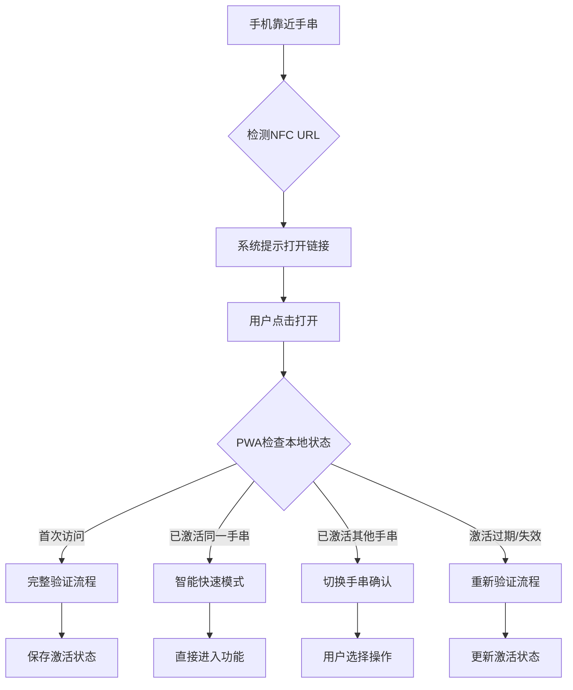

# 🔄 NFC重复访问智能处理设计

## 🎯 场景分析

### 用户行为场景

1. **首次验证** - 用户第一次靠近手串，完成激活验证
2. **日常使用** - 用户日常修行时靠近手串（最常见）
3. **重复验证** - 用户多次在短时间内靠近手串
4. **长期重访** - 用户在很长时间后再次靠近手串
5. **其他手串** - 用户靠近不同的手串

### 系统行为分析



## 🧠 智能处理策略

### 1. 本地状态检查机制

```javascript
// 本地存储结构
interface LocalBraceletState {
  chipId: string;
  braceletId: string; 
  lastVerified: number;
  activationCount: number;
  quickAccessEnabled: boolean;
  userPreferences: {
    autoEnterPractice: boolean;
    showWelcomeAnimation: boolean;
    enableHapticFeedback: boolean;
  };
}

// 智能状态检查
const checkBraceletState = (nfcParams: NFCParams): AccessType => {
  const localState = getLocalBraceletState(nfcParams.chip);
  
  if (!localState) {
    return 'first_time'; // 首次访问
  }
  
  if (localState.chipId !== nfcParams.chip) {
    return 'different_bracelet'; // 不同手串
  }
  
  const timeSinceLastAccess = Date.now() - localState.lastVerified;
  const ONE_HOUR = 60 * 60 * 1000;
  const ONE_DAY = 24 * ONE_HOUR;
  const ONE_WEEK = 7 * ONE_DAY;
  
  if (timeSinceLastAccess < ONE_HOUR) {
    return 'quick_access'; // 快速访问模式
  } else if (timeSinceLastAccess < ONE_DAY) {
    return 'daily_practice'; // 日常修行模式
  } else if (timeSinceLastAccess < ONE_WEEK) {
    return 'regular_return'; // 常规返回
  } else {
    return 'long_term_return'; // 长期重访
  }
};
```

### 2. 分层处理策略

#### 🚀 快速访问模式 (< 1小时)
```javascript
const handleQuickAccess = (nfcParams, localState) => {
  // 无需网络验证，直接进入
  showQuickWelcome(localState.braceletInfo);
  
  // 震动反馈
  navigator.vibrate([50, 30, 50]);
  
  // 1秒后自动进入手串功能
  setTimeout(() => {
    navigateToPage('bracelet');
  }, 1000);
  
  // 记录快速访问
  trackEvent('nfc_quick_access', {
    chipId: nfcParams.chip,
    timeSinceLastAccess: Date.now() - localState.lastVerified
  });
};
```

#### 🧘‍♂️ 日常修行模式 (1小时 - 1天)
```javascript
const handleDailyPractice = async (nfcParams, localState) => {
  // 显示修行欢迎界面
  showPracticeWelcome();
  
  // 轻量级验证（检查手串状态更新）
  const quickVerify = await verifyBraceletStatus(nfcParams.chip);
  
  if (quickVerify.success) {
    // 更新能量等级等动态信息
    updateLocalBraceletData(quickVerify.updates);
    
    // 显示今日修行建议
    showDailyPracticeGuide(localState.braceletInfo);
    
    // 用户选择：继续修行 或 查看状态
    showActionOptions(['开始修行', '查看手串', '功德记录']);
  } else {
    // 降级到完整验证
    handleFullVerification(nfcParams);
  }
};
```

#### 🔄 常规返回模式 (1天 - 1周)
```javascript
const handleRegularReturn = async (nfcParams, localState) => {
  showWelcomeBack(localState.braceletInfo);
  
  // 中等程度验证
  const verification = await verifyBraceletWithCache(nfcParams);
  
  if (verification.success) {
    // 显示期间的变化摘要
    showUpdatesSummary(verification.changes);
    
    // 继续到手串页面
    navigateToPage('bracelet');
  } else {
    handleVerificationError(verification.error);
  }
};
```

#### 📅 长期重访模式 (> 1周)
```javascript
const handleLongTermReturn = async (nfcParams, localState) => {
  showLongTermWelcome();
  
  // 完整重新验证
  const fullVerification = await verifyNFCURL(nfcParams);
  
  if (fullVerification.success) {
    // 更新本地状态
    updateLocalBraceletState(fullVerification.data);
    
    // 显示期间的重要更新
    showWhatsNew(fullVerification.updates);
    
    navigateToPage('bracelet');
  } else {
    handleVerificationError(fullVerification.error);
  }
};
```

### 3. 多手串处理

```javascript
const handleDifferentBracelet = (nfcParams, currentState) => {
  Modal.confirm({
    title: '🔍 检测到不同的手串',
    content: (
      <div>
        <p>当前激活的手串：<strong>{currentState.braceletInfo.name}</strong></p>
        <p>检测到的手串：<strong>{nfcParams.bracelet}</strong></p>
        <br />
        <p>您想要如何处理？</p>
      </div>
    ),
    okText: '切换到新手串',
    cancelText: '继续使用当前手串',
    onOk: async () => {
      // 验证新手串
      const newVerification = await verifyNFCURL(nfcParams);
      if (newVerification.success) {
        // 保存新手串，保留旧手串历史
        saveMultipleBracelets(currentState, newVerification.data);
        navigateToPage('bracelet');
      }
    },
    onCancel: () => {
      // 继续使用当前手串
      navigateToPage('bracelet');
    }
  });
};
```

## 🎨 用户界面设计

### 1. 快速访问界面

```jsx
const QuickAccessWelcome = ({ braceletInfo }) => {
  return (
    <motion.div
      initial={{ opacity: 0, scale: 0.8 }}
      animate={{ opacity: 1, scale: 1 }}
      transition={{ duration: 0.5 }}
      className="quick-access-welcome"
    >
      <div className="zen-icon">
        <motion.div
          animate={{ rotate: [0, 10, -10, 0] }}
          transition={{ duration: 2, repeat: Infinity }}
        >
          📿
        </motion.div>
      </div>
      
      <h2>欢迎回来</h2>
      <p className="bracelet-name">{braceletInfo.name}</p>
      
      <div className="quick-stats">
        <div className="stat">
          <span className="value">{braceletInfo.energyLevel}%</span>
          <span className="label">当前能量</span>
        </div>
        <div className="stat">
          <span className="value">{braceletInfo.todayPractice || 0}</span>
          <span className="label">今日修行</span>
        </div>
      </div>
      
      <motion.div
        initial={{ width: 0 }}
        animate={{ width: '100%' }}
        transition={{ duration: 1 }}
        className="progress-bar"
      />
      
      <p className="auto-redirect">正在进入手串功能...</p>
    </motion.div>
  );
};
```

### 2. 日常修行界面

```jsx
const DailyPracticeWelcome = ({ braceletInfo, practiceGuide }) => {
  return (
    <motion.div className="daily-practice-welcome">
      <div className="time-greeting">
        <h2>{getTimeGreeting()}</h2>
        <p>🧘‍♂️ 新的一天，新的修行</p>
      </div>
      
      <div className="bracelet-status">
        
        <div className="status-info">
          <h3>{braceletInfo.name}</h3>
          <div className="energy-ring">
            <svg viewBox="0 0 36 36">
              <path
                d="M18 2.0845 a 15.9155 15.9155 0 0 1 0 31.831 a 15.9155 15.9155 0 0 1 0 -31.831"
                fill="none"
                stroke="#e6e6e6"
                strokeWidth="3"
              />
              <path
                d="M18 2.0845 a 15.9155 15.9155 0 0 1 0 31.831 a 15.9155 15.9155 0 0 1 0 -31.831"
                fill="none"
                stroke="#4caf50"
                strokeWidth="3"
                strokeDasharray={`${braceletInfo.energyLevel}, 100`}
              />
            </svg>
            <span className="energy-text">{braceletInfo.energyLevel}%</span>
          </div>
        </div>
      </div>
      
      <div className="practice-suggestions">
        <h4>💡 今日修行建议</h4>
        <div className="suggestions">
          {practiceGuide.suggestions.map((suggestion, index) => (
            <motion.div
              key={index}
              initial={{ x: -20, opacity: 0 }}
              animate={{ x: 0, opacity: 1 }}
              transition={{ delay: index * 0.2 }}
              className="suggestion-item"
            >
              <span className="icon">{suggestion.icon}</span>
              <span className="text">{suggestion.text}</span>
            </motion.div>
          ))}
        </div>
      </div>
      
      <div className="action-buttons">
        <motion.button
          whileHover={{ scale: 1.05 }}
          whileTap={{ scale: 0.95 }}
          className="btn primary"
          onClick={() => startPractice()}
        >
          🧘‍♂️ 开始修行
        </motion.button>
        <button className="btn secondary" onClick={() => viewBracelet()}>
          📿 查看手串
        </button>
        <button className="btn tertiary" onClick={() => viewMerit()}>
          🏆 功德记录
        </button>
      </div>
    </motion.div>
  );
};
```

### 3. 长期重访界面

```jsx
const LongTermWelcome = ({ braceletInfo, updates }) => {
  return (
    <motion.div className="long-term-welcome">
      <motion.div
        initial={{ y: -50, opacity: 0 }}
        animate={{ y: 0, opacity: 1 }}
        className="welcome-header"
      >
        <h2>🙏 久未相见，甚是想念</h2>
        <p>您的法宝一直在等待您的归来</p>
      </motion.div>
      
      <div className="time-away">
        <p>距离上次使用已过去 <strong>{getTimeAway(braceletInfo.lastAccess)}</strong></p>
      </div>
      
      {updates.length > 0 && (
        <div className="whats-new">
          <h4>✨ 在您离开期间</h4>
          <div className="updates-list">
            {updates.map((update, index) => (
              <motion.div
                key={index}
                initial={{ opacity: 0, y: 20 }}
                animate={{ opacity: 1, y: 0 }}
                transition={{ delay: index * 0.3 }}
                className="update-item"
              >
                <span className="icon">{update.icon}</span>
                <div>
                  <h5>{update.title}</h5>
                  <p>{update.description}</p>
                </div>
              </motion.div>
            ))}
          </div>
        </div>
      )}
      
      <motion.button
        initial={{ scale: 0 }}
        animate={{ scale: 1 }}
        transition={{ delay: 1, type: "spring" }}
        className="btn primary large"
        onClick={() => continueToBracelet()}
      >
        ✨ 重新开始修行之旅
      </motion.button>
    </motion.div>
  );
};
```

## 📊 智能优化特性

### 1. 学习用户习惯

```javascript
const UserHabitLearning = {
  // 学习用户访问模式
  learnAccessPattern: (accessHistory) => {
    const patterns = {
      morningPractice: checkMorningPattern(accessHistory),
      eveningPractice: checkEveningPattern(accessHistory),
      weekendIntensive: checkWeekendPattern(accessHistory),
      quickAccess: checkQuickAccessPreference(accessHistory)
    };
    
    return patterns;
  },
  
  // 个性化建议
  generatePersonalizedSuggestions: (patterns, currentTime) => {
    const suggestions = [];
    
    if (patterns.morningPractice && isMorningTime(currentTime)) {
      suggestions.push({
        icon: '🌅',
        text: '开始您的晨练修行',
        action: 'morning_practice'
      });
    }
    
    if (patterns.quickAccess) {
      suggestions.push({
        icon: '⚡',
        text: '快速查看手串状态',
        action: 'quick_status'
      });
    }
    
    return suggestions;
  }
};
```

### 2. 预加载优化

```javascript
const PreloadOptimization = {
  // 预测用户需求
  predictUserNeeds: async (accessType, braceletInfo) => {
    switch (accessType) {
      case 'daily_practice':
        // 预加载修行相关数据
        await Promise.all([
          preloadSutraContent(),
          preloadMeritHistory(),
          preloadPracticeGuide()
        ]);
        break;
        
      case 'quick_access':
        // 预加载基础状态数据
        await preloadBraceletStatus();
        break;
        
      case 'long_term_return':
        // 预加载更新和变化
        await Promise.all([
          preloadSystemUpdates(),
          preloadUserProgress(),
          preloadCommunityHighlights()
        ]);
        break;
    }
  }
};
```

## 🔧 技术实现要点

### 1. 更新的验证流程

```javascript
// 更新后的主验证函数
const handleNFCURLVerification = async () => {
  try {
    const urlParams = parseURLParams();
    const accessType = checkBraceletState(urlParams);
    
    // 根据访问类型选择处理策略
    switch (accessType) {
      case 'first_time':
        await handleFirstTimeVerification(urlParams);
        break;
        
      case 'quick_access':
        await handleQuickAccess(urlParams, getLocalState());
        break;
        
      case 'daily_practice':
        await handleDailyPractice(urlParams, getLocalState());
        break;
        
      case 'regular_return':
        await handleRegularReturn(urlParams, getLocalState());
        break;
        
      case 'long_term_return':
        await handleLongTermReturn(urlParams, getLocalState());
        break;
        
      case 'different_bracelet':
        await handleDifferentBracelet(urlParams, getLocalState());
        break;
    }
    
    // 更新访问记录
    updateAccessHistory(urlParams, accessType);
    
  } catch (error) {
    handleVerificationError(error);
  }
};
```

### 2. 本地状态管理

```javascript
const LocalStateManager = {
  // 保存访问状态
  saveAccessState: (chipId, data) => {
    const states = getStoredStates();
    states[chipId] = {
      ...data,
      lastVerified: Date.now(),
      accessCount: (states[chipId]?.accessCount || 0) + 1
    };
    localStorage.setItem('bracelet_states', JSON.stringify(states));
  },
  
  // 清理过期状态
  cleanupExpiredStates: () => {
    const states = getStoredStates();
    const oneMonth = 30 * 24 * 60 * 60 * 1000;
    const now = Date.now();
    
    Object.keys(states).forEach(chipId => {
      if (now - states[chipId].lastVerified > oneMonth) {
        delete states[chipId];
      }
    });
    
    localStorage.setItem('bracelet_states', JSON.stringify(states));
  }
};
```

## 🎯 用户体验效果

### 预期行为总结

| 访问间隔 | 用户体验 | 验证程度 | 响应时间 |
|----------|----------|----------|----------|
| **< 1小时** | 🚀 瞬间进入，无感知验证 | 仅本地检查 | < 0.5秒 |
| **1小时-1天** | 🧘‍♂️ 修行导向，智能建议 | 轻量级验证 | < 2秒 |
| **1天-1周** | 📖 欢迎回来，状态更新 | 中等验证 | < 3秒 |
| **> 1周** | 🌟 重新开始，完整体验 | 完整验证 | < 5秒 |

### 业务价值

1. **提升用户粘性** - 智能化的重复访问体验
2. **减少摩擦** - 避免不必要的重复验证
3. **个性化体验** - 基于使用习惯的智能建议
4. **数据洞察** - 丰富的用户行为数据收集

---

这样的设计确保了用户在首次验证后的每次NFC接触都能获得最优的体验，从瞬间进入到个性化建议，真正实现了"丝滑"的使用流程！ 🚀✨ 