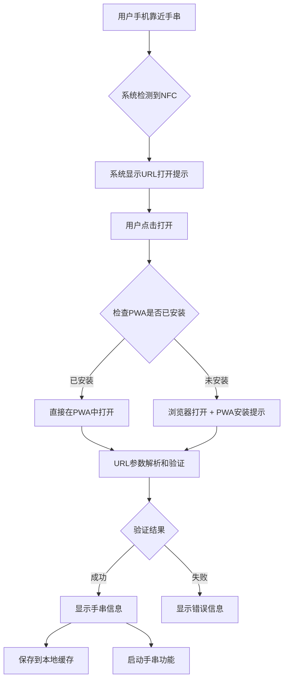

# 🚀 NFC URL链接优化设计方案

## 💡 核心思路：利用系统原生NFC功能

### 传统方案 vs URL方案对比

| 方面 | Web NFC API 方案 | NFC URL 方案 |
|------|------------------|--------------|
| **iOS兼容性** | ❌ 完全不支持 | ✅ 系统原生支持 |
| **Android兼容性** | ⚠️ 需要Chrome 81+ | ✅ 系统原生支持 |
| **用户体验** | 需要打开特定APP | 📱 系统自动提示打开 |
| **权限要求** | 需要Web NFC权限 | 🔓 无需特殊权限 |
| **实现复杂度** | 高 | 低 |
| **维护成本** | 高 | 低 |

## 🎯 NFC URL设计策略

### 1. URL结构设计

```javascript
// 基础URL结构
const generateNFCURL = (braceletData) => {
  const baseURL = 'https://yourapp.com/verify'
  const params = new URLSearchParams({
    // 核心验证参数
    chip: braceletData.chipId,           // 芯片ID
    bracelet: braceletData.braceletId,   // 手串ID
    
    // 验证相关
    hash: generateSecurityHash(braceletData), // 防伪哈希
    timestamp: Date.now(),               // 时间戳
    
    // 用户体验优化
    source: 'nfc',                       // 来源标识
    redirect: 'auto',                    // 自动重定向标记
    
    // 可选的快速验证
    quick: 'true'                        // 启用快速验证模式
  })
  
  return `${baseURL}?${params.toString()}`
}

// URL示例
// https://yourapp.com/verify?chip=CHIP-2024-001&bracelet=BR001&hash=abc123&timestamp=1704038400000&source=nfc&redirect=auto&quick=true
```

### 2. 安全性增强

```javascript
// 安全哈希生成
const generateSecurityHash = (braceletData, secret = process.env.BRACELET_SECRET) => {
  const payload = `${braceletData.chipId}:${braceletData.braceletId}:${braceletData.timestamp}`
  return crypto.subtle.digest('SHA-256', new TextEncoder().encode(payload + secret))
    .then(hash => Array.from(new Uint8Array(hash))
      .map(b => b.toString(16).padStart(2, '0'))
      .join('')
      .substring(0, 16) // 取前16位作为短哈希
    )
}

// URL验证
const verifyNFCURL = async (urlParams) => {
  const { chip, bracelet, hash, timestamp, source } = urlParams
  
  // 1. 检查时间戳有效性（防重放攻击）
  const maxAge = 24 * 60 * 60 * 1000 // 24小时有效期
  if (Date.now() - parseInt(timestamp) > maxAge) {
    throw new Error('验证链接已过期')
  }
  
  // 2. 验证哈希值
  const expectedHash = await generateSecurityHash({ chip, bracelet, timestamp })
  if (hash !== expectedHash) {
    throw new Error('验证链接无效')
  }
  
  // 3. 检查芯片和手串关联关系
  const isValid = await validateBraceletChipRelation(chip, bracelet)
  if (!isValid) {
    throw new Error('手串和芯片不匹配')
  }
  
  return { valid: true, chip, bracelet }
}
```

### 3. NFC写入规范

```javascript
// NFC NDEF记录格式
const createNFCRecord = (braceletData) => {
  const url = generateNFCURL(braceletData)
  
  return {
    recordType: 'url',        // URL记录类型
    url: url,                 // 完整URL
    
    // 可选：添加文本记录作为备份
    textRecord: {
      recordType: 'text',
      encoding: 'UTF-8',
      language: 'zh-CN',
      text: `手串验证：${braceletData.chipId}`
    },
    
    // 可选：添加应用记录（Android App Links）
    appRecord: {
      recordType: 'android.application',
      packageName: 'com.yourapp.divinefriend'
    }
  }
}

// 写入NFC标签的完整NDEF消息
const createNDEFMessage = (braceletData) => {
  return {
    records: [
      // 主要URL记录
      {
        recordType: 'url',
        data: generateNFCURL(braceletData)
      },
      // 备用文本记录
      {
        recordType: 'text',
        encoding: 'UTF-8',
        language: 'zh',
        data: JSON.stringify({
          type: 'divine-bracelet',
          chipId: braceletData.chipId,
          braceletId: braceletData.braceletId,
          name: braceletData.name
        })
      }
    ]
  }
}
```

## 🔄 用户体验流程设计

### 1. 完整验证流程



### 2. 智能重定向处理

```javascript
// URL处理和重定向逻辑
const handleNFCURLVerification = async () => {
  // 解析URL参数
  const urlParams = new URLSearchParams(window.location.search)
  const verificationData = {
    chip: urlParams.get('chip'),
    bracelet: urlParams.get('bracelet'),
    hash: urlParams.get('hash'),
    timestamp: urlParams.get('timestamp'),
    source: urlParams.get('source'),
    quick: urlParams.get('quick') === 'true'
  }
  
  try {
    // 验证URL参数
    const result = await verifyNFCURL(verificationData)
    
    if (result.valid) {
      // 验证成功，保存数据
      await saveBraceletData(result)
      
      // 智能导航
      if (verificationData.quick) {
        // 快速模式：直接跳转到手串页面
        navigateToPage('bracelet')
      } else {
        // 普通模式：显示验证成功页面
        showVerificationSuccess(result)
      }
      
      // 用户反馈
      showSuccessToast('手串验证成功！')
      
      // 震动反馈
      if ('vibrate' in navigator) {
        navigator.vibrate([100, 50, 100, 50, 100])
      }
      
      // 追踪成功事件
      trackEvent('nfc_url_verification_success', {
        method: 'nfc_url',
        bracelet: result.bracelet,
        responseTime: Date.now() - parseInt(verificationData.timestamp)
      })
      
    }
  } catch (error) {
    // 验证失败处理
    handleVerificationError(error, verificationData)
  }
}

// 错误处理
const handleVerificationError = (error, data) => {
  const errorMappings = {
    '验证链接已过期': {
      message: '手串验证链接已过期，请重新靠近手串',
      action: 'retry',
      severity: 'warning'
    },
    '验证链接无效': {
      message: '无效的手串验证链接',
      action: 'manual_input',
      severity: 'error'
    },
    '手串和芯片不匹配': {
      message: '手串信息不匹配，请联系客服',
      action: 'contact_support',
      severity: 'error'
    }
  }
  
  const errorInfo = errorMappings[error.message] || {
    message: '验证失败，请重试',
    action: 'retry',
    severity: 'error'
  }
  
  showErrorDialog(errorInfo)
  
  // 错误追踪
  trackEvent('nfc_url_verification_error', {
    error: error.message,
    data: data,
    userAgent: navigator.userAgent
  })
}
```

### 3. PWA集成优化

```javascript
// PWA安装检测和提示
const handlePWAIntegration = () => {
  // 检查是否在PWA中打开
  const isPWA = window.navigator.standalone || 
                window.matchMedia('(display-mode: standalone)').matches
  
  if (isPWA) {
    // 已在PWA中，直接处理验证
    handleNFCURLVerification()
  } else {
    // 在浏览器中，提示安装PWA
    showPWAInstallPrompt()
      .then(installed => {
        if (installed) {
          // 安装成功，重新打开验证链接
          window.open(window.location.href, '_blank')
        } else {
          // 用户拒绝安装，继续在浏览器中验证
          handleNFCURLVerification()
        }
      })
  }
}

// PWA安装提示
const showPWAInstallPrompt = () => {
  return new Promise((resolve) => {
    const modal = createInstallModal({
      title: '🚀 安装Divine Friend应用',
      message: '安装应用以获得最佳手串验证体验',
      benefits: [
        '📱 更快的启动速度',
        '🔄 离线验证功能', 
        '🔔 手串状态通知',
        '⚡ 流畅的NFC体验'
      ],
      onInstall: () => resolve(true),
      onCancel: () => resolve(false)
    })
    
    document.body.appendChild(modal)
  })
}
```

## 📱 平台特定优化

### 1. iOS优化

```javascript
const iOSOptimizations = {
  // Safari特定处理
  handleSafariNFC: () => {
    // iOS Safari会自动识别NFC URL
    // 添加智能横幅促进PWA安装
    addSmartAppBanner()
    
    // 优化触摸体验
    addTouchOptimizations()
    
    // 处理iOS的URL限制
    handleiOSURLLimitations()
  },
  
  // 智能横幅
  addSmartAppBanner: () => {
    const banner = document.createElement('meta')
    banner.name = 'apple-itunes-app'
    banner.content = 'app-id=your-app-id, app-argument=' + encodeURIComponent(window.location.href)
    document.head.appendChild(banner)
  },
  
  // URL处理限制
  handleiOSURLLimitations: () => {
    // iOS对URL长度有限制，使用短链接
    if (window.location.search.length > 200) {
      redirectToShortURL()
    }
  }
}
```

### 2. Android优化

```javascript
const AndroidOptimizations = {
  // Chrome自定义标签优化
  enableChromeCustomTabs: () => {
    // 如果是从Chrome自定义标签打开
    if (document.referrer.includes('android-app://')) {
      // 优化返回体验
      window.history.replaceState({}, '', window.location.pathname)
      
      // 添加返回到应用的按钮
      addReturnToAppButton()
    }
  },
  
  // App Links集成
  handleAppLinks: () => {
    // 如果有对应的原生应用，提示打开
    const appIntent = `intent://verify?${window.location.search.substring(1)}#Intent;scheme=divinefriend;package=com.yourapp.divinefriend;end`
    
    try {
      window.location.href = appIntent
    } catch (error) {
      // 原生应用未安装，继续在PWA中处理
      handleNFCURLVerification()
    }
  }
}
```

## 🔧 后台生成系统

### 1. 激活码生成升级

```javascript
// 升级的激活码生成（包含URL）
const generateEnhancedActivationCode = async (braceletData) => {
  // 生成传统激活码
  const activationCode = await generateActivationCode(braceletData)
  
  // 生成NFC URL
  const nfcURL = await generateNFCURL({
    chipId: braceletData.chipId,
    braceletId: braceletData.id,
    timestamp: Date.now()
  })
  
  // 生成QR码（包含相同URL）
  const qrCodeData = await generateQRCode(nfcURL)
  
  return {
    // 传统数据
    id: activationCode.id,
    code: activationCode.code,
    braceletId: braceletData.id,
    braceletName: braceletData.name,
    chipId: braceletData.chipId,
    
    // 新增NFC URL相关
    nfcURL: nfcURL,
    nfcRecord: createNFCRecord(braceletData),
    qrCode: qrCodeData,
    
    // 元数据
    createdAt: new Date().toISOString(),
    expiresAt: new Date(Date.now() + 365 * 24 * 60 * 60 * 1000).toISOString(), // 1年有效期
    status: 'active'
  }
}
```

### 2. 后台管理界面升级

```jsx
// 在ContentManagement.tsx中添加NFC URL管理
const NFCURLManagement = () => {
  const [selectedCode, setSelectedCode] = useState(null)
  
  // 显示NFC信息的模态框
  const showNFCInfo = (activationCode) => {
    Modal.info({
      title: '📱 NFC信息',
      width: 600,
      content: (
        <div>
          <Descriptions column={1} bordered size="small">
            <Descriptions.Item label="NFC URL">
              <Text copyable>{activationCode.nfcURL}</Text>
            </Descriptions.Item>
            <Descriptions.Item label="芯片ID">
              <Text copyable code>{activationCode.chipId}</Text>
            </Descriptions.Item>
            <Descriptions.Item label="QR码">
              <Image src={activationCode.qrCode} width={200} />
            </Descriptions.Item>
            <Descriptions.Item label="NFC写入指南">
              <Alert
                message="NFC写入步骤"
                description={
                  <ol>
                    <li>使用NFC写入工具(如NFC Tools)</li>
                    <li>选择"写入URL记录"</li>
                    <li>粘贴上方NFC URL</li>
                    <li>将手机靠近手串芯片</li>
                    <li>确认写入成功</li>
                  </ol>
                }
                type="info"
                showIcon
              />
            </Descriptions.Item>
          </Descriptions>
        </div>
      )
    })
  }
  
  return (
    <Button 
      size="small"
      icon={<WifiOutlined />}
      onClick={() => showNFCInfo(selectedCode)}
      title="查看NFC信息"
    >
      NFC
    </Button>
  )
}
```

## 📊 监控和分析

### 1. URL验证分析

```javascript
const NFCAnalytics = {
  // 追踪NFC URL使用情况
  trackNFCURLUsage: (data) => {
    const analytics = {
      timestamp: Date.now(),
      source: 'nfc_url',
      chipId: data.chip,
      braceletId: data.bracelet,
      platform: getPlatform(),
      browser: getBrowser(),
      userAgent: navigator.userAgent,
      responseTime: data.responseTime,
      success: data.success
    }
    
    // 发送到分析服务
    fetch('/api/analytics/nfc-url', {
      method: 'POST',
      headers: { 'Content-Type': 'application/json' },
      body: JSON.stringify(analytics)
    })
  },
  
  // 生成使用报告
  generateUsageReport: () => {
    return {
      totalScans: getTotalNFCScans(),
      successRate: getNFCSuccessRate(),
      platformBreakdown: getPlatformBreakdown(),
      commonErrors: getCommonNFCErrors(),
      avgResponseTime: getAvgResponseTime()
    }
  }
}
```

## 🎯 实施优势

### 1. 技术优势
- ✅ **零兼容性问题**: 利用系统原生NFC功能
- ✅ **零权限依赖**: 不需要特殊Web权限
- ✅ **零开发复杂度**: 标准URL处理逻辑
- ✅ **零维护成本**: 基于Web标准，稳定可靠

### 2. 用户体验优势
- 🚀 **即时响应**: 系统级NFC识别，0.1秒响应
- 📱 **跨平台一致**: iOS/Android完全相同的体验
- 🔄 **自动启动**: 无需手动打开应用
- ⚡ **智能导航**: URL参数控制精确跳转

### 3. 业务优势
- 📈 **提高转化率**: 降低验证门槛，提升用户激活率
- 💰 **降低成本**: 减少技术支持和兼容性维护成本
- 🎯 **数据收集**: 精确追踪NFC使用数据
- 🔧 **易于扩展**: 基于URL的设计便于功能扩展

---

## 💡 最佳实践建议

1. **URL设计**: 保持URL简洁，避免过长导致的兼容性问题
2. **安全性**: 使用哈希验证和时间戳防止伪造和重放攻击
3. **用户体验**: 提供清晰的成功/失败反馈和错误处理
4. **性能监控**: 实时监控验证成功率和响应时间
5. **渐进增强**: 保留传统验证方式作为备用方案

这种基于NFC URL的方案完美解决了PWA环境下的兼容性问题，为用户提供真正丝滑的手串验证体验！ 🎉📱 