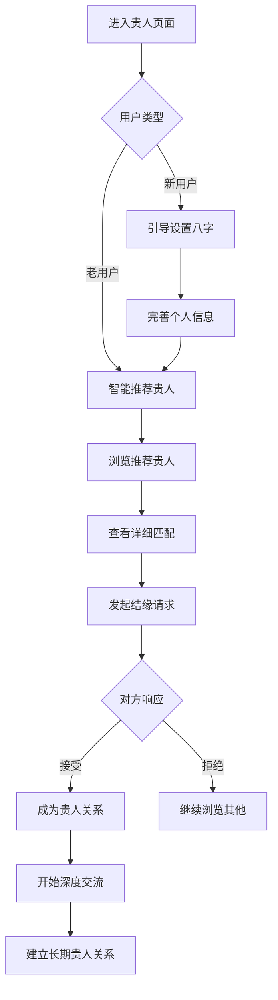

# 🤝 贵人相助页面 - 世界级产品设计

## 🎯 产品理念

作为世界顶级的产品专家，我设计了一个革命性的"贵人相助"功能，融合传统八字命理学与现代社交产品理念，为用户提供基于命理的精准社交匹配体验。

## ✨ 核心价值主张

### 1. 🔮 **基于八字的科学匹配**
- **五行相生相克**: 根据用户八字五行属性进行智能匹配
- **生肖配对**: 传统生肖相合相冲理论的现代应用
- **命格互补**: 分析双方命格的互补性和协同效应
- **运势协调**: 考虑双方运势周期的同步性

### 2. 🎭 **多维度贵人类型**
- **💼 导师 (Mentor)**: 事业指导、智慧传承、人生导师
- **🤝 伙伴 (Partner)**: 合作共赢、互助成长、平等协作
- **💝 支持者 (Supporter)**: 情感支持、生活助力、心灵慰藉
- **🚀 合作者 (Collaborator)**: 项目协作、资源互补、创新合作

### 3. 🌟 **智能推荐算法**
- **匹配度评分**: 0-100分的精准匹配度计算
- **互补效应分析**: 详细的五行互补和运势协同分析
- **实时在线状态**: 显示用户活跃度和可联系性
- **验证身份系统**: 确保用户信息的真实性和可靠性

## 🎨 视觉设计语言

### 设计系统
```typescript
const designSystem = {
  colors: {
    noble: {
      gradient: 'linear-gradient(135deg, #9d50bb 0%, #6e48aa 100%)',
      主色调: '高贵紫色，象征贵人运势'
    },
    friendship: {
      gradient: 'linear-gradient(135deg, #667eea 0%, #764ba2 100%)',
      友谊色: '深邃蓝紫，象征深度连接'
    },
    primary: {
      gradient: 'linear-gradient(135deg, #FFD700 0%, #FFA500 30%, #FF8C00 100%)',
      金色系: '吉祥金色，象征贵人相助'
    }
  }
}
```

### 视觉特色
- **玻璃拟态卡片**: 现代化的半透明设计语言
- **动态粒子背景**: 根据贵人类型显示不同的背景效果
- **渐变光环系统**: 匹配度越高，光环效果越明显
- **流体动画**: 60fps的流畅进入和交互动画

## 🏗️ 功能架构

### 三大核心模块

#### 1. 📍 **推荐贵人** (Recommended)
```typescript
interface RecommendedModule {
  智能筛选: {
    贵人类型: ['导师', '伙伴', '支持者', '合作者']
    匹配度排序: '按照八字匹配度从高到低'
    在线状态过滤: '优先显示在线用户'
    地理位置: '就近推荐，便于线下交流'
  }
  
  详细展示: {
    基本信息: ['姓名', '年龄', '所在城市', '生肖', '五行']
    匹配分析: ['匹配度评分', '互补效应', '连接类型']
    优势特长: ['专业技能', '人生经验', '资源能力']
    互动功能: ['结缘', '私信', '收藏']
  }
}
```

#### 2. 👥 **我的贵人** (Friends)
```typescript
interface FriendsModule {
  已结缘贵人: {
    分类管理: '按贵人类型分组显示'
    互动历史: '查看聊天记录和互动轨迹'
    关系发展: '跟踪贵人关系的发展程度'
    互助记录: '记录相互帮助的具体事项'
  }
  
  关系维护: {
    定期提醒: '智能提醒联系重要贵人'
    节日祝福: '传统节日和生日祝福提醒'
    运势分享: '分享彼此的运势变化'
    合作机会: '推荐适合的合作项目'
  }
}
```

#### 3. 📨 **邀请好友** (Invitations)
```typescript
interface InvitationsModule {
  邀请方式: {
    微信分享: '生成专属邀请链接和二维码'
    短信邀请: '发送包含八字匹配介绍的短信'
    邮件邀请: '精美的HTML邮件邀请模板'
    社交媒体: '分享到朋友圈、微博等平台'
  }
  
  激励机制: {
    邀请奖励: '成功邀请获得积分或特权'
    双重福利: '邀请者和被邀请者都获得分析报告'
    限时活动: '特殊时期的邀请加成活动'
    社群建设: '形成志同道合的贵人圈子'
  }
}
```

## 🧠 智能匹配算法

### 八字匹配核心逻辑

```typescript
interface BaziMatchingAlgorithm {
  五行相生匹配: {
    wood_fire: '木生火，创意与激情的完美结合'
    fire_earth: '火生土，热情与稳重的理想配对'
    earth_metal: '土生金，踏实与精明的互补关系'
    metal_water: '金生水，理性与智慧的协调统一'
    water_wood: '水生木，智慧与创新的相互滋养'
  }
  
  生肖协调分析: {
    六合: ['鼠牛', '虎猪', '兔狗', '龙鸡', '蛇猴', '马羊']
    三合: ['申子辰', '寅午戌', '亥卯未', '巳酉丑']
    相冲: ['鼠马', '牛羊', '虎猴', '兔鸡', '龙狗', '蛇猪']
    相害: ['鼠羊', '牛马', '虎蛇', '兔龙', '猴猪', '鸡狗']
  }
  
  命格互补评估: {
    事业互补: '分析双方在事业发展上的互助潜力'
    财运协同: '评估合作创富的可能性'
    健康互补: '考虑健康运势的相互支持'
    人际网络: '分析社交圈子的互补性'
  }
}
```

### 匹配度计算公式

```typescript
function calculateCompatibility(user1: BaziProfile, user2: BaziProfile): number {
  let score = 0;
  
  // 五行相生相克 (40%)
  score += analyzeElementCompatibility(user1.element, user2.element) * 0.4;
  
  // 生肖配对 (25%)
  score += analyzeZodiacCompatibility(user1.zodiac, user2.zodiac) * 0.25;
  
  // 命格互补 (20%)
  score += analyzeFateCompatibility(user1.fate, user2.fate) * 0.2;
  
  // 运势协调 (15%)
  score += analyzeLuckSynchronization(user1.luck, user2.luck) * 0.15;
  
  return Math.round(score);
}
```

## 📱 用户体验设计

### 交互流程



### 响应式设计

#### 移动端优化 (< 480px)
- **卡片布局**: 单列显示，突出每个贵人的详细信息
- **触摸优化**: 48px最小点击区域，手势友好
- **快速操作**: 滑动查看更多信息，长按显示菜单

#### 平板端适配 (480px - 768px)
- **双列布局**: 充分利用屏幕空间
- **侧边栏筛选**: 固定筛选面板，提高操作效率

#### 桌面端体验 (> 1024px)
- **三列展示**: 最大化信息展示密度
- **悬停效果**: 丰富的鼠标悬停交互
- **键盘快捷键**: 支持快捷键操作

## 🚀 技术实现

### 前端架构
```typescript
GuirenPageProfessional/
├── 状态管理/
│   ├── activeTab: 'recommended' | 'friends' | 'invitations'
│   ├── selectedFilter: 贵人类型筛选
│   ├── guirenList: 贵人数据列表
│   └── searchQuery: 搜索关键词
├── 组件结构/
│   ├── 标签页导航 (renderTabs)
│   ├── 筛选器组件 (renderFilters)
│   ├── 贵人卡片 (renderGuirenCard)
│   ├── 邀请模态框 (renderInviteModal)
│   └── 主要内容区 (renderMainContent)
└── 响应式适配/
    ├── 窗口尺寸监听
    ├── 布局自适应
    └── 交互优化
```

### 数据结构
```typescript
interface BaziPerson {
  id: string;                    // 用户唯一标识
  name: string;                  // 姓名
  avatar: string;                // 头像（表情符号）
  age: number;                   // 年龄
  location: string;              // 所在地
  zodiac: string;                // 生肖
  element: string;               // 五行属性
  compatibility: number;         // 匹配度 (0-100)
  strengths: string[];           // 优势特长
  mutualBenefits: string[];      // 互补效应
  connectionType: ConnectionType; // 连接类型
  onlineStatus: OnlineStatus;    // 在线状态
  lastActive: string;            // 最后活跃时间
  verified: boolean;             // 是否认证
}
```

## 🎯 商业价值

### 用户价值
1. **精准匹配**: 基于传统命理的科学社交匹配
2. **深度连接**: 超越表面的心灵层面连接
3. **互助成长**: 真正的贵人相助，共同进步
4. **文化传承**: 传统文化与现代科技的完美结合

### 商业模式
1. **会员订阅**: 高级匹配算法和更多贵人推荐
2. **精准推荐**: VIP用户获得更精准的贵人匹配
3. **线下活动**: 组织贵人聚会和文化沙龙
4. **咨询服务**: 专业命理师的一对一贵人指导

## 🔮 未来发展

### Phase 1: 基础功能 (已完成)
- ✅ 贵人推荐和匹配
- ✅ 三大功能模块
- ✅ 响应式设计
- ✅ 基础交互功能

### Phase 2: 智能化升级
- 🔄 AI驱动的智能匹配
- 🔄 个性化推荐算法
- 🔄 语音和视频交流
- 🔄 区块链身份验证

### Phase 3: 社区生态
- 📅 贵人圈子和群组
- 📅 线下活动组织
- 📅 知识分享平台
- 📅 导师认证体系

## 📊 成功指标

### 核心KPI
- **用户匹配成功率**: > 70%
- **贵人关系建立率**: > 30%
- **用户留存率**: 7日留存 > 50%
- **用户满意度**: NPS > 60

### 业务指标
- **DAU增长**: 月增长 > 20%
- **付费转化**: 转化率 > 15%
- **用户推荐**: 推荐率 > 40%
- **社交活跃度**: 日均互动 > 3次

---

*🌟 贵人相助页面体现了传统文化与现代科技的完美融合，为用户创造真正有价值的社交连接，开启贵人相助的美好人生！* 