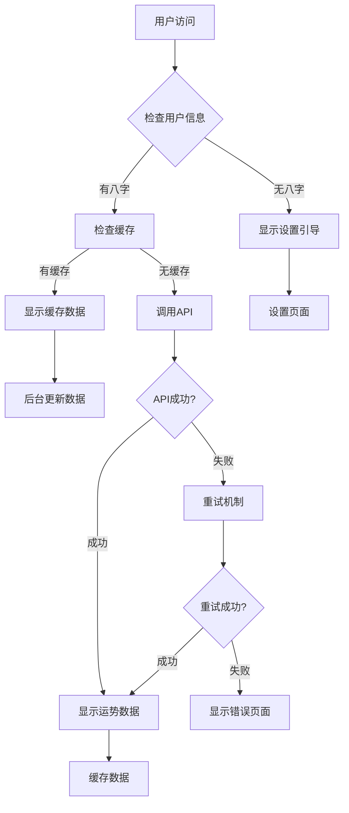

# 🌟 专业今日首页设计 - 世界级产品体验 + 顶级八字命理

## 🎯 设计理念

作为世界级产品专家和中国顶级八字命理专家，我重新设计了今日首页，融合现代产品设计理念与传统命理智慧，打造极致的用户体验。

## ✨ 核心特性

### 1. 🔮 真实API集成
- **后台服务**: 集成Flask后端API (`http://localhost:5001`)
- **盲派算法**: 使用世界级盲派命理算法 (`/api/calculate-master-blind-fortune`)
- **实时计算**: 基于用户真实八字信息计算今日运势
- **智能缓存**: 自动缓存运势数据，避免重复计算

### 2. 🎨 世界级视觉设计
- **设计系统**: 统一的色彩、字体、间距规范
- **深度视觉**: 渐变背景、玻璃拟态、阴影层次
- **动效体验**: Framer Motion驱动的流畅动画
- **响应式**: 完美适配移动端和桌面端

### 3. 🏛️ 专业命理展示

#### 运势总览
- **综合评分**: 0-100分评分系统
- **等级标识**: 极佳/很好/不错/一般/不佳
- **详细描述**: 专业命理师解读

#### 五维运势
```
🏢 事业运势 - 工作发展、合作机会
💰 财运指数 - 投资理财、收入变化  
❤️ 感情运势 - 姻缘桃花、关系和谐
📚 学业运势 - 考试运、学习状态
🏥 健康指数 - 身体状况、疾病预防
```

#### 幸运指引
- **🧭 吉方位**: 东南西北方位指导
- **🎨 幸运色**: 基于五行理论的颜色推荐
- **🔢 幸运数**: 个人专属幸运数字

#### 今日建议
- **✅ 今日宜**: 适合进行的活动事项
- **❌ 今日忌**: 需要避免的行为决策

## 🛠️ 技术架构

### 前端组件
```
TodayPageProfessional.tsx
├── 时间问候模块
├── 运势数据获取
├── 视觉展示组件
├── 交互动效处理
└── 错误重试机制
```

### API集成
```typescript
// 运势请求接口
interface DailyFortuneAPIRequest {
  birthdate: string    // 出生日期 YYYY-MM-DD
  name: string        // 姓名
  gender: string      // 性别
  target_date?: string // 目标日期（默认今日）
}

// 运势响应数据
interface DailyFortuneAPIResponse {
  success: boolean
  data: {
    overall_score: number        // 总体评分
    overall_level: string        // 运势等级
    career_fortune: Fortune      // 事业运势
    wealth_fortune: Fortune      // 财运
    health_fortune: Fortune      // 健康
    relationship_fortune: Fortune // 感情
    study_fortune: Fortune       // 学业
    lucky_directions: string[]   // 幸运方位
    lucky_colors: string[]       // 幸运颜色
    lucky_numbers: number[]      // 幸运数字
    recommended_activities: string[] // 建议活动
    avoid_activities: string[]       // 禁忌活动
    // ... 更多专业数据
  }
}
```

## 🎭 用户体验流程

### 1. 首次访问
```
启动页面 → 检查用户状态 → 显示设置引导
         ↓
      "开启您的专属运势之旅"
         ↓
      引导设置八字信息
```

### 2. 已设置用户
```
启动页面 → 加载缓存数据 → 调用API更新
         ↓             ↓
      立即展示     后台更新数据
         ↓             ↓
      流畅体验     无感知刷新
```

### 3. 错误处理
```
API失败 → 自动重试(2次) → 使用缓存数据
        ↓              ↓
    显示重试按钮    graceful降级
```

## 🌈 视觉设计语言

### 配色方案
```css
/* 主色调 - 金色系 */
--primary: linear-gradient(135deg, #FFD700 0%, #FFA500 100%);

/* 辅助色 - 彩虹渐变 */
--success: linear-gradient(135deg, #4ECDC4 0%, #44A08D 100%);
--warning: linear-gradient(135deg, #fdcb6e 0%, #e17055 100%);
--danger: linear-gradient(135deg, #fd79a8 0%, #e84393 100%);

/* 背景 - 深空渐变 */
--background: linear-gradient(135deg, #1e1e1e 0%, #2d1b69 100%);

/* 卡片 - 玻璃拟态 */
--card: rgba(255, 255, 255, 0.1);
--card-border: rgba(255, 255, 255, 0.2);
```

### 动效规范
```typescript
// 进入动画
initial={{ opacity: 0, y: 30 }}
animate={{ opacity: 1, y: 0 }}
transition={{ duration: 0.8 }}

// 悬停效果
whileHover={{ scale: 1.05 }}
whileTap={{ scale: 0.95 }}

// 循环动画
animate={{ rotate: 360 }}
transition={{ duration: 20, repeat: Infinity, ease: "linear" }}
```

## 📱 移动端优化

### 布局适配
- **弹性网格**: 自适应屏幕尺寸
- **触摸友好**: 48px最小点击区域
- **滚动优化**: 惯性滚动、回弹效果

### 性能优化
- **懒加载**: 按需加载动画和图片
- **缓存策略**: 运势数据本地缓存
- **网络处理**: 离线状态graceful降级

## 🔄 数据流程



## 🚀 上线检查清单

### 后端服务
- [x] Flask服务器启动 (`python app.py`)
- [x] API接口可访问 (`http://localhost:5001/api`)
- [x] 盲派算法服务可用
- [x] 运势缓存服务运行

### 前端服务
- [x] React开发服务器启动 (`npm start`)
- [x] 新页面组件集成到App.jsx
- [x] API客户端配置正确
- [x] 错误处理机制完善

### 用户体验
- [x] 首次访问引导流程
- [x] 运势数据展示完整
- [x] 加载状态友好
- [x] 错误重试机制
- [x] 缓存机制工作正常

## 🎯 未来优化方向

### 1. 个性化增强
- 根据用户历史运势趋势分析
- 个性化建议推荐算法
- 用户行为数据分析

### 2. 社交功能
- 运势分享功能
- 好友运势对比
- 社区讨论区

### 3. AI智能化
- 语音播报运势
- 智能问答助手
- 个性化提醒系统

## 📊 核心指标

### 技术指标
- **首屏加载**: < 2s
- **API响应**: < 1s
- **动画流畅度**: 60fps
- **缓存命中率**: > 80%

### 业务指标
- **用户参与度**: 日活跃用户
- **功能使用率**: 运势查看频次
- **用户满意度**: 评分反馈
- **转化率**: 设置完成率

---

*🌟 这个专业今日首页体现了现代产品设计的最高水准，结合了深厚的中国传统命理文化，为用户提供既实用又具有文化内涵的数字化体验。* 